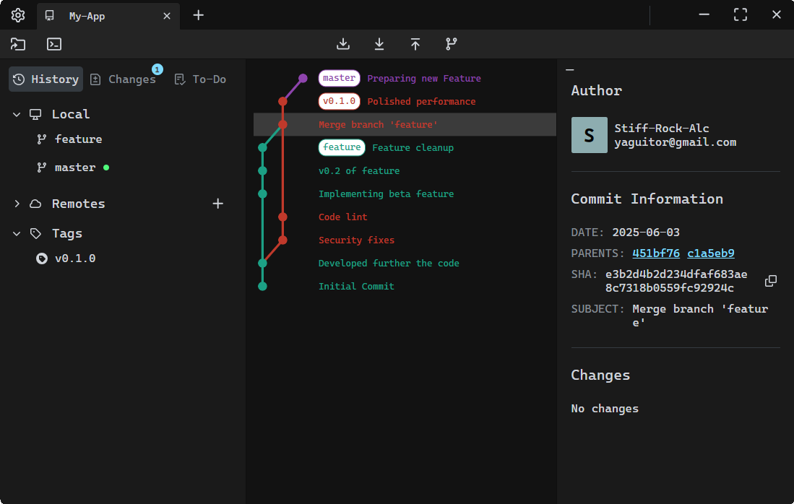

##  GitTaur - Una cliente de Git veloz y sencillo

GitTaur es una GUI para Git diseñada para aprovechar la velocidad y eficiencia de Rust y la experiencia moderna de usuario de React.

## Créditos

Este proyecto no habría sido posible sin el gran trabajo de la comunidad de código abierto. Especial agradecimiento a los siguientes proyectos:

- [**git2json por fabien0102**](https://github.com/fabien0102/git2json) - Sin Licencia  
  Inspiró la lógica de conversión de los registros de Git al formato JSON. Esta funcionalidad ha sido completamente reimplementada en Rust para el backend de GitTaur.

- [**gitgraph.js por nicoespeon**](https://github.com/nicoespeon/gitgraph.js/) - Licencia MIT  
  Utilizado como base para el renderizado de gráficos en GitTaur. Se adaptó un fork personalizado para satisfacer las necesidades específicas de la aplicación.

- [**auth-git2-rs por de-vri-es**](https://github.com/de-vri-es/auth-git2-rs) - Licencia BSD-2-Clause  
  Proporcionó utilidades cruciales para manejar la autenticación en las operaciones del backend de `git2-rs`.

GitTaur utiliza muchos otros paquetes y crates de código abierto del ecosistema de Rust y JavaScript/React. Para una lista completa de todas las bibliotecas y licencias, 
puedes consultar [CREDITS.md](./CREDITS.md).
