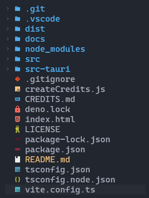
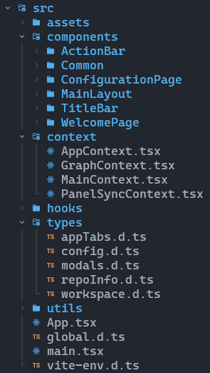
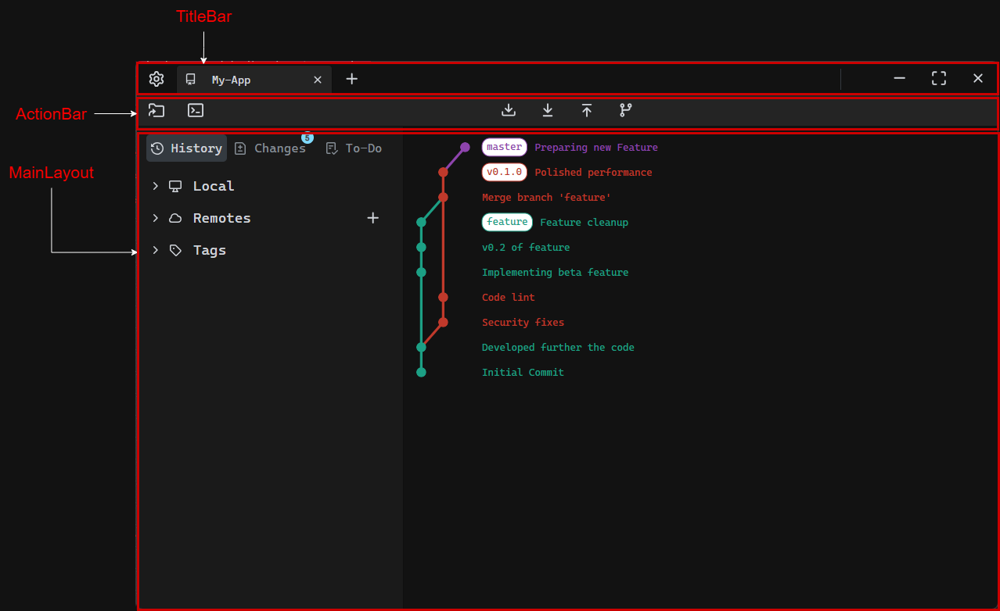
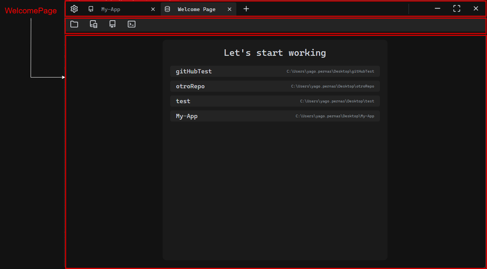
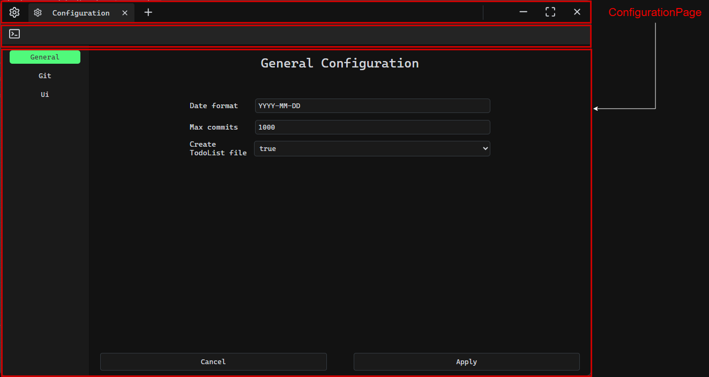
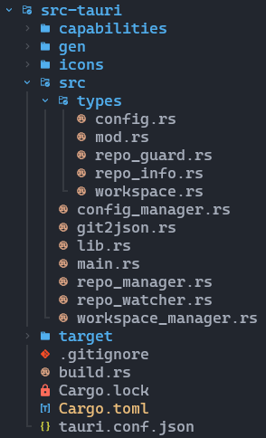

## Código implementado

En este apartado vamos a abordar los aspectos más importantes del proyecto de manera general, explicando la estructura que compone a la aplicación y algunos ejemplos de código.

<br>

<div style="display: flex; gap: 30px; margin-bottom: 20px;">


<span style="align-self: center; text-align: justify;">
    En la raíz del proyecto se encuentran diversos archivos y carpetas, la mayoría destinados a dependencias, configuraciones o documentación. 
    Las dos carpetas más importantes son: <code>src</code>, que contiene el código del frontend desarrollado en React, 
    y <code>src-tauri</code>, que alberga el backend implementado en Rust.
</span>
</div>

---

### src/

<div style="display: flex; gap: 30px; margin-bottom: 20px;">
<span style="align-self: center; text-align: justify;">
    En el apartado del frontend, la aplicación se organiza en varias carpetas que estructuran el código. Las principales son:
<ul>
    <li><strong>components:</strong> Contiene los componentes principales de la aplicación, que a su vez se dividen en componentes en subcarpetas, 
    encapsulando el comportamiento de la UI.</li>
    <li><strong>context:</strong> Define los contextos de React para manejar estados globales.</li>
    <li><strong>types:</strong> Incluye definiciones de tipos utilizados para la serialización y deserialización de datos entre 
    el backend y el frontend, garantizando coherencia en la comunicación. Además, contiene algunos tipos exclusivos del frontend 
    que sirven para estructurar y manejar datos específicos de la interfaz.</li>
    <li><strong>utils:</strong> Funciones auxiliares que son utilizadas en diferentes partes de la aplicación.</li>
</ul>
</span>


</div>

Podemos ver los principales componentes de la UI en estos esquemas:

<div style="display: flex; flex-direction: column; align-items: center; gap: 20px; margin-bottom: 20px;">





</div>

El componente principal que une todos los elementos del frontend es `App.tsx`. Este componente actúa como el punto de entrada para la interfaz de usuario, organizando y gestionando los distintos elementos que conforman la aplicación. A continuación se muestra el código de `App.tsx`:

```tsx
/* Imports */

function App() {
  
  /* Estados y efectos... */

  return (
    <main className="container">
      <TitleBar />
      <ActionBar />
      <ToastContainer
        className="NotificationToast"
        position="top-right"
        autoClose={3000}
        newestOnTop
        hideProgressBar={true}
        pauseOnHover
        pauseOnFocusLoss
        transition={Zoom}
      />

      <WelcomePage />
      <ConfigPage />

      {workspace &&
        <PanelSyncProvider>
          {[...workspace.tabs].map(([key, _]) => (
            isType("Repo", key) && (
              <MainProvider key={key} repoPath={key}>
                <MainLayout
                  key={key}
                  isActive={workspace.activeTab === key}
                />
              </MainProvider>
            ))
          )}
        </PanelSyncProvider>
      }

      {activeModal === "confirmation" && <ConfirmationModal />}
    </main>
  );
}

export default App;
```

#### Desglose del componente `App.tsx`

1. **Elementos persistentes:**  
   - `<TitleBar />` y `<ActionBar />` son componentes que forman parte de la interfaz principal y permanecen visibles en todo momento.
     
2. **Notificaciones:**  
   - `<ToastContainer />` gestiona las notificaciones emergentes en la aplicación. Estas son temporales y desaparecen automáticamente después de un tiempo configurado (3000 ms en este caso).

3. **Vista inicial y configuración:**  
   - `<WelcomePage />` y `<ConfigPage />` son componentes que se muestran dependiendo del estado de la aplicación. Se autogestionan para ser visibles solo cuando es necesario.

4. **Renderizado dinámico de repositorios:**  
   - La última sección destaca por su gestión dinámica de vistas. Aquí se realiza un renderizado condicional basado en los repositorios abiertos por el usuario:
     - **Iteración de pestañas:** Se recorre cada repositorio abierto (`workspace.tabs`) y se genera un componente `<MainLayout>` para cada uno.
     - **Contextos adicionales:** Cada vista está envuelta en su propio contexto (`<MainProvider>`), lo que permite gestionar estados y lógica específicos para cada repositorio.
     - **Pestañas dinámicas:** Cada repositorio abierto se refleja en el `<TitleBar />` como una pestaña interactiva.

5. **Modales:**  
   - `<ConfirmationModal />` es un componente que se renderiza de manera condicional cuando el estado `activeModal` indica que debe mostrarse. Esto permite manejar interacciones específicas como confirmaciones de acciones.

#### Resumen

El diseño de esta vista es solo un ejemplo de entre muchos otros componentes que utilizan mecanismos similares, entre otros:
- **Renderizado condicional:** Para mostrar u ocultar elementos en función del estado actual de la aplicación.
- **Contextos:** Proporcionando estados y lógica comunes entre componentes dentro del mismo.
- **Modularidad:** Dividiendo la interfaz en componentes reutilizables que gestionan su propia lógica y presentación.

Esta aquitectura permite felixibilidad, escalabilidad y dinamismo, mejorando la UX incluso en vistas complejas.

---

### src-tauri/
<br>

<div style="display: flex; gap: 30px; margin-bottom: 20px;">


<span style="align-self: center; text-align: justify;">
En el backend, encontramos archivos de configuración junto con la carpeta <code>src</code>, que contiene el código principal del backend. 
Esta se divide en:

<ul>
<li><strong>Raíz:</strong> Archivos que definen la lógica principal del backend, como <code>main.rs</code> y otros módulos que implementan 
comportamientos clave.</li>
<li><strong>types:</strong> Carpeta que contiene definiciones de estructuras (<code>structs</code>), implementaciones (<code>impl</code>) 
y tipos utilizados para la comunicación entre el frontend y el backend.</li>
</ul>
</span>
</div>

El punto de entrada de la aplicación está en `main.rs`, posiblemente el archivo más breve de todos, ya que se compone sencillamente
de una llamada a la función `run()` ubicada en `lib.rs`, donde realmente se encuentra la inicialización de la aplicación, el backend y los
canales de enlace con el frontend.

```main.rs
// Prevents additional console window on Windows in release, DO NOT REMOVE!!
#![cfg_attr(not(debug_assertions), windows_subsystem = "windows")]

fn main() {
    gittaur_lib::run()
}
```

```lib.rs
{/* Imports y otras funciones de la app */}

#[cfg_attr(mobile, tauri::mobile_entry_point)]
pub fn run() {
    let run_result = tauri::Builder::default()
         /* Inicialización de plugins de Tauri */
        .plugin(tauri_plugin_opener::init())
        .plugin(tauri_plugin_shell::init())
        .plugin(tauri_plugin_dialog::init())
        .plugin(tauri_plugin_os::init())
        /* Definición de las funciones que 
           deben ser expuestas para poder ser
           llamadas desde el frontend */
        .invoke_handler(tauri::generate_handler![
            create_todo_file,
            save_todo_file,
            open_terminal,

            {/*...*/}
        ])
        /* Acciones personalizadas a realizar 
           durante la inicialización de la aplicación,
           manejando posibles errores que surjan de cada una
           (cargar configuraciones o pestañas previamente 
           abiertas, iniciar el logger, etc.). */    
        .setup(|app| {
            if let Err(e) = setup_logging(app) {
                handle_setup_error(e)?;
            }
            if let Err(e) = init_app_paths(app) {
                handle_setup_error(e)?;
            }
            if let Err(e) = set_app_globals(app) {
                handle_setup_error(e)?;
            }
            if let Err(e) = setup_app_theme(app) {
                handle_setup_error(e)?;
            }

            trace!("Setup finished!");

            Ok(())
        })
        .run(tauri::generate_context!());

    /* Manejo de errores que puedan surgir durante la inicialización de la app */
    if let Err(e) = run_result {
        let msg = format!("Error while running GitTaur: {e}");
        error!("{msg}");
        tinyfiledialogs::message_box_ok(
            "GitTaur Error",
            &msg,
            tinyfiledialogs::MessageBoxIcon::Error,
        );
        std::process::exit(1);
    }
}
```

Los archivos con el sufijo `_manager` encapsulan la lógica necesaria para gestionar aspectos funcionales clave de la aplicación. Estos ayudan a modularizar la lógica del programa y facilitan la organización del código. Entre los principales archivos se encuentran:

- **`config_manager`:** Gestiona la configuración de la aplicación, incluyendo la carga, actualización y almacenamiento de parámetros.
- **`workspace_manager`:** Maneja las pestañas abiertas y el estado del espacio de trabajo del usuario.
- **`repo_manager`:** Encargado de la interacción con los repositorios. Es vital para el funcionamiento del programa ya que implementa todas las funcionalidades relacionadas con el control de los repositorios. Utiliza la librería [git2-rs](https://crates.io/crates/git2) para proporcionar un control de bajo nivel sobre los repositorios, permitiendo extraer información, modificar estados y añadir datos según sea necesario.

#### Ejemplo de una función en `repo_manager`

A continuación, se muestra un ejemplo del tipo de funcionalidad implementada en el archivo `repo_manager`. En este caso, la función `get_repo_info()` se encarga de recolectar información sobre el repositorio que el usuario abre para posteriormente mostrarla en la interfaz de usuario.

```rust name=repo_manager.rs
/* Atributo que indica que esta función es un comando 
que puede (y debe) ser expuesto al frontend */
#[command] 
pub async fn get_repo_info(repo_path: String) -> Result<RepoInfo, String> {
    info!("Getting info of repo {}", repo_path);

    // Adquirimos el lock del repositorio, de esta manera aseguramos la concurrencia
    let _repo_lock = RepoGuard::new(&repo_path, true)?;

    /* Comprobamos que el string dado por parámetro 
    se corresponde con un directorio de un repositorio*/
    if !is_repo(&repo_path, true)? {
        return Err(format!("{} is not a repository", &repo_path));
    }

    // Abrimos el repositorio (usando la librería git2-rs)
    let repo = Repository::open(&repo_path).map_err(|e| e.to_string())?;
    let name = repo_path.to_string();

    // Comprobamos la cabecera del repositorio
    let main_branch: String;
    if repo.head_detached().map_err(|e| e.to_string())? {
        main_branch = "master".to_string();
    } else {
        let head = repo.head().map_err(|e| e.to_string())?;
        if let Some(branch_name) = head.shorthand() {
            main_branch = branch_name.to_string();
        } else {
            let msg: &str = "Could not determine the current branch";
            error!("{msg}");
            return Err(format!("Error: {msg}"));
        }
    }

    // Obtenemos la rama activa actual
    let current_branch = get_current_branch(&repo);

    // Obtenemos una lista de las ramas locales
    let local_branches = repo
        .branches(Some(git2::BranchType::Local))
        .map_err(|e| e.to_string())?
        .filter_map(|b| b.ok())
        .filter_map(|(b, _)| b.name().ok().flatten().map(|s| s.to_owned()))
        .collect::<Vec<String>>();

    // Obtenemos una lista de las etiquetas del repositorio
    let tags = repo
        .tag_names(None)
        .map_err(|e| e.to_string())?
        .iter()
        .filter_map(|t| t.map(|s| s.to_string()))
        .collect::<Vec<String>>();

    // Obtenemos un HashMap de los remotos y las ramas de cada uno
    let remotes: HashMap<String, Remote> = get_remote_branches(&repo)?;

    /* Envolvemos la información en el objeto `RepoInfo` 
    para su serialización y envío al frontend */
    let repo = RepoInfo {
        name,
        main_branch,
        current_branch,
        local_branches,
        remotes,
        tags,
    };

    // Devolvemos el resultado exitoso
    Ok(repo)
}
```

Desde el frontend, se llamaria a esta función de la siguiente manera:

```ts
import { invoke } from "@tauri-apps/api/core";

function obtenerInfoRepositorio() {
    const directorio = "C:\\Users\\yago.pernas\\Documents\\Proyecto";

    invoke<RepoInfo>("get_repo_info", {repoPath: directorio})
        .then((value) => console.log("Información obtenida:" , value))
        .catch((e) => console.error("Error obteniendo información del repositorio:", e))
        .finally(() => {/* Efecutar limpieza necesaria en caso de error*/});;  
}
```
---

Estos son solo algunos ejemplos de la estructura de código que se pueden encontrar en **GitTaur**. 
Siguiendo los estándares establecidos por Tauri, se garantiza que el proyecto sea coherente, claro 
y funcional. Además, esta estructura modular y bien organizada permite que la aplicación escale tanto 
en dimensión como en complejidad sin comprometer la claridad ni la mantenibilidad del código.
