## Características y uso

### Pantalla de bienvenida
Esta es la primera pantalla que aparecerá al iniciar la aplicación por primera vez. Desde esta vista disponemos de acciones en forma de botones en la parte superior.
En órden: Abrir repositorio, clonar repositorio, crear repositorio y abrir terminal. En la parte central podremos ver los repositorios que se hayan abierto recientemente
y haciendo click izquierdo podremos abrirlo o podremos borrarlo o realizar otra accion sobre el haciendo click derecho.

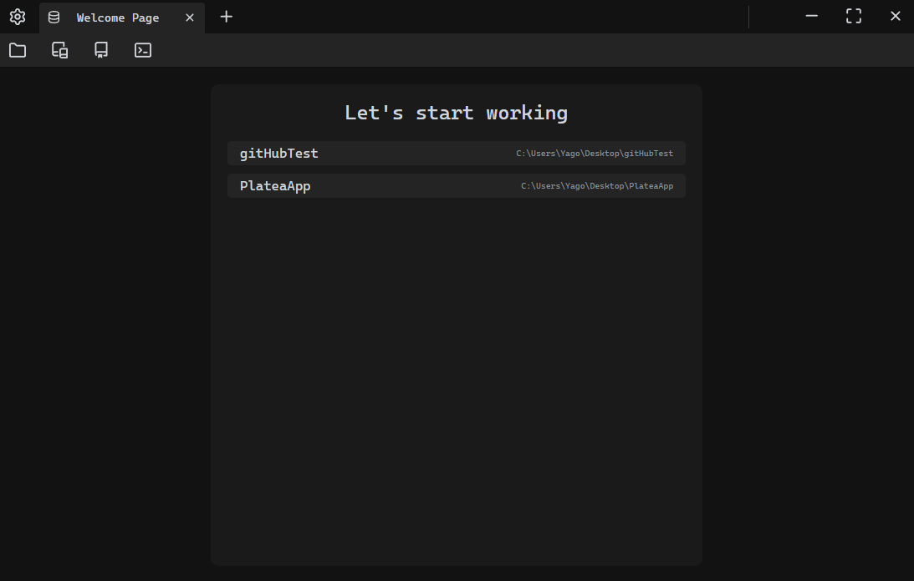

### Visialización del y gestión del historial del repositorio (Pestaña principal)

 

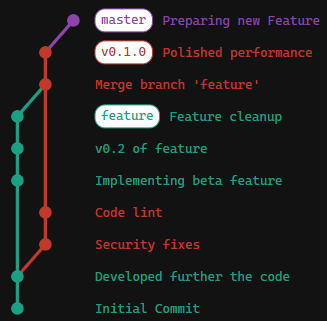

    GitTaur provee un gráfico que representa el historial del repositorio. En el mismo podemos ver los commits, ramas y tags.
    Puedes hacer click derecho en cualquier commit para abrir el menu de acciones sobre ese commit.

    
    Muchos de los elementos de la aplicación tienen acciones en el menu contextual. En el caso de un commit puedes encontrar 
    las mas fundamentales como checkout, revert, tag entre otras utilidades.

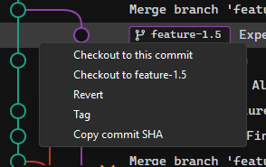

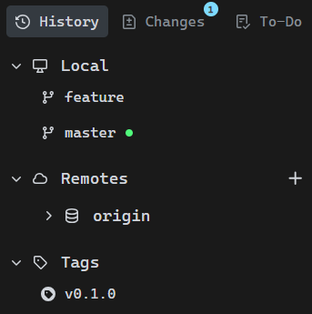

    En el panel izquierdo hay dos secciones principales. 
    En la parte superior tenemos tres botones para navegar entre las diferentes áreas de trabajo:

<ul>
<li>
<b>History</b>: Visualiza el historial del repositorio.
</li>

<li>
<b>Changes</b>: Gestiona cambios en curso.
</li>

<li>
<b>To-Do</b>: Abre un editor Markdown para listas de tareas.
</li>
</ul>

Debajo hay tres menús desplegables: 
<b>Local</b>: Muestra ramas locales; 
<b>Remotes</b>: Remotos asociados con ramas desplegables; 
<b>Tags</b>: Etiquetas del repositorio. 
Cada elemento tiene un menú contextual para realizar operaciones. Este panel es fijo entre áreas de trabajo.

    Cualquier commit que selecciones en el gráfico mostrará su información específica de manera estructurada y fácil de leer.
    Adicionalmente en la parte inferior se podrá ver que cambios fueron efectuados en ese commit.

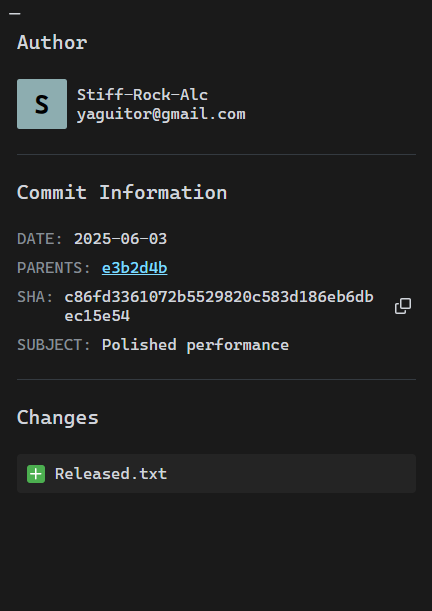

 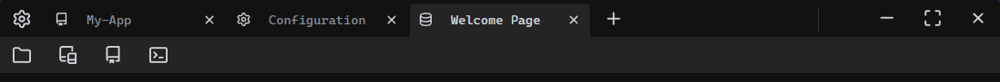

En la parte superior encontramos los siguientes elementos empezando por la barra en la parte más superior de la aplicación:

- Botón de configuración: Abre una nueva pestaña para ajustar las preferencias relacionadas con la aplicación o con Git.
- Pestañas abiertas: Se muestran todas las pestañas abiertas ya sean repositorios, la pantalla de bienvenida o la configuración.
- Botones de control de la ventana: Controles básicos para gestionar la ventana (minimizar, maximizar, cerrar).

Debajo se sitúa la barra de acciones, la cual contiene diferentes botones que cambian en funcion de la pestaña en la que se encuentre
el usuario. 
 
 
Podemos encontrar acciones globales como:

<ul style="display: flex; flex-direction: column; gap: 10px;">
<li>
     
    Abre el repositorio en el explorador de archivos
</li>

<li>
     
    Abre la terminal en el directorio del repositorio
</li>
</ul>

O acciones de Git:
<ul style="display: flex; flex-direction: column; gap: 10px;">
<li>
     
    Efectua un fetch al remoto que se indique en el pop-up que aparecerá
</li>

<li>
     
    Aplicla los nuevos cambios del remoto seleccionado al repositorio local si los hubiera
</li>
<li>
     
    Sube los cambios del repositorio local al repositorio remoto seleccionado
</li>

<li>
     
    Permite crear una rama a partir del commit en el que se encuentre el repositorio
</li>
</ul>

Entre otros...

---

### Administración de los cambios en curso

En el área de trabajo de "Changes" podremos ver, confirmar o descartar cambios que se hayan realizado en el proyecto desde el último commit
o gestionar los stash creados.

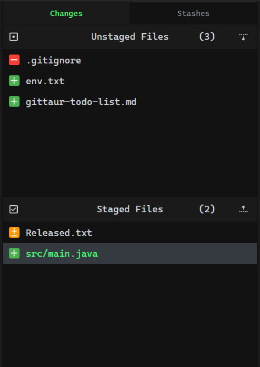

    En la parte central superior se ubican dos botones para cambiar el contenido entre los cambios locales o los stashes. Debajo tenemos dos contenedores.
    El superior muestra los cambios que no están preparados para incluir en un commit, mientras que el inferior muestra los que si están en el staging area.

    En el panel derecho se muestra el contenido de los cambios del archivo seleccionado, indicando con un '+' las lineas añadidas y con un '-' las eliminadas
    y en la parte inferior encontramos dos campos de texto y un botón para crear un nuevo commit con el resumen y el cuerpo escritos.

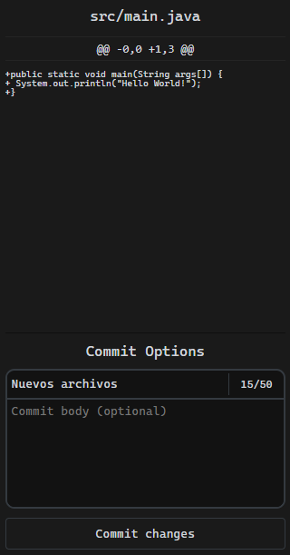

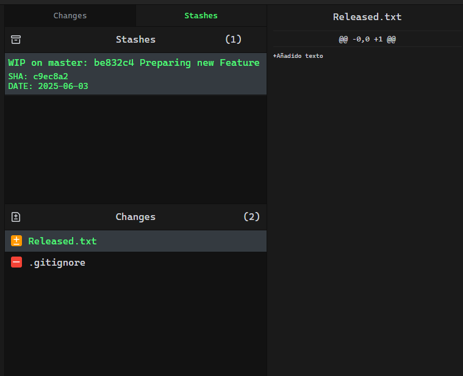

    Si pulsamos el botón superior de 'Stashes' el contenido pasará a mostrar en la parte centras los stashes creados, en la parte inferior los archivos 
    que lo conforman y en el panel derecho muestra el contenido del archivo que se seleccione.

---

### Creación listas de tareas del proyecto
La última área de trabajo permite al usuario crear un archivo de tipo `markdown` almacenado en la raiz de su proyecto. El contenido es totalemnte libre,
teniendo a disposición un editor y una vista previa para sacar partido de las capacidades de los archivos markdown, pudiendo hacer listas de tareas del 
proyecto, recordatorios, tablas, esquemas o cualquier otro tipo de documento que pueda ayudar con proceso de desasrrollo del proyecto.

    En el editor se dispone de las mismas herramientas y capacidades que cualquier editor de texto pero con la sintaxis de markdown.
    También se puede mostrar la vista previa dividiento el editor en dos o activar la pantalla completa usando los botones a la derecha del editor.

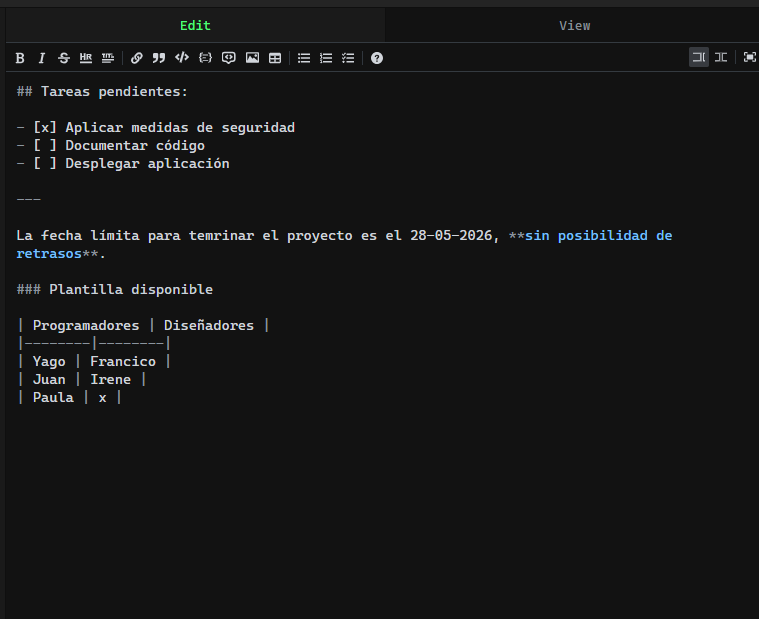

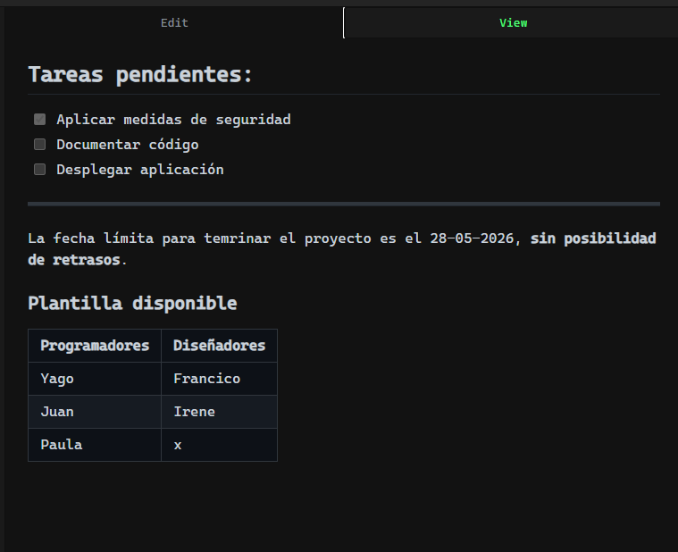

    En la vista previa podemos ver el resultado del texto ya renderizado con la estructura que hayamos redactado en el editor.

---

### Pantalla de configuración
Haciendo click en el icono del engranaje se abrirá la pestaña de configuración, donde podemos personalizar opciones relacionadas
con características generales de la aplicación, su aspecto o configuraciones de Git.

  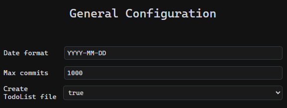

  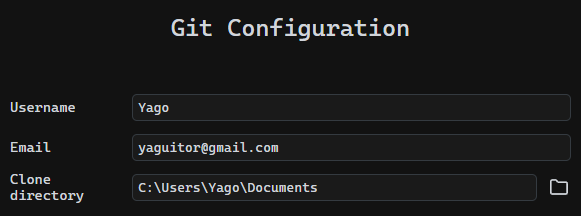

  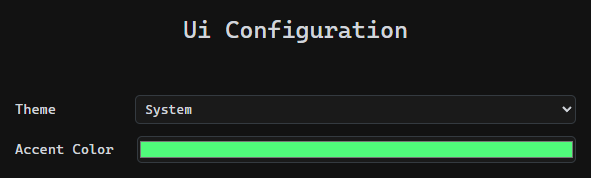

---
