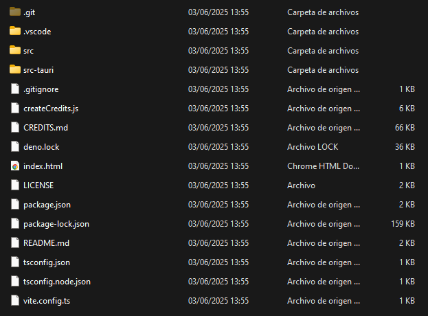
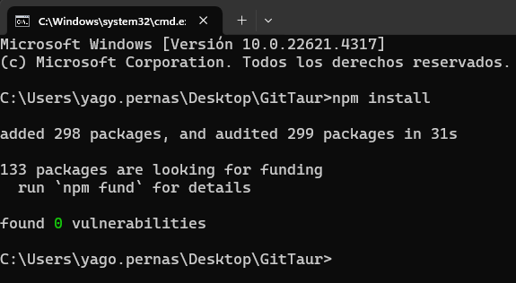

## Instalación de GitTaur

### Para usuarios
GitTaur esta disponile para Windows 10 en adelante, para su correcto funcionamiento será necesario disponer de [Git](https://git-scm.com/) instalado en tu sistema, puesto que la aplicación interactua con el para cualquier operacion relacionada con los repositorios.

Existen 3 formas de obtener GitTaur:
- Instalador .msi: Puede requerir permisos de administrador.
- Instalador .exe: No requiere permisos de administrador, instala unicamente al usuario si se desea.
- Apliación portable: No requiere instalación ninguna, se pude ejecutar directamente.

Se pueden encontrar en [la página de releases del repositorio](https://github.com/Stiff-Rock/GitTaur/releases/latest)

Elige la que mas se adecue a tus necesidades.

### Para desarrolladores
Si deseas ejecutar este proyecto en tu IDE, estos son los requisitos:
- Los archivos del proyecto, disponibles en el [repositorio oficial de GitTaur](https://github.com/Stiff-Rock/GitTaur).
- [Microsoft C++ Build Tools](https://visualstudio.microsoft.com/es/visual-cpp-build-tools/) y [WebView2](https://developer.microsoft.com/en-us/microsoft-edge/webview2/?form=MA13LH#download-section) (normalmente incluido en Windows) para el funcionamiento de Tauri.
- Compilador del lenguaje Rust, disponible en [rust-lang.org](https://www.rust-lang.org/tools/install)
- Node.js para la ejecución de JavaScript/TypeScipt, disponible en [nodejs.org](https://nodejs.org/es)

Una vez cumplidos los requisitos, estos son los pasos a seguir para poder poner en funcionamiento el proyecto:

    
     
        Dirígete a la carpeta donde hayas descargado el proyecto y abre una terminal en la raíz del proyecto (deberías ver lo mismo que en la foto).
    

    
     
        Ahora, desde la línea de comandos, ejecuta <code>npm install</code>, esto instalará las dependencias del frontend. Una vez finalice (como en la imagen) podrás ejecutar el programa desde la terminal con <code>npm run tauri dev</code>.  <b>Ten en cuenta que la primera vez que ejecutes la aplicación puede llevar un rato</b>, ya que automáticamente se descargarán todas las dependencias del backend.
    

Ahora ya puedes empezar a modificar el código como quieras. Los cambios del frontend (los archivos ubicados en `src`) deberían actualizarse automáticamente mientras tengas la aplicacion ejecutando, en cualquier caso puedes refrescar la interfaz con `F5` o `Ctrl + Shift + R`. Para los cambios del backend (los archivos ubicados en `src-tauri`) tendrás que reiniciar la aplicación, por lo que deberás interrumpir la ejecución de la terminal pulsando `Ctrl + C` o cerrándola y abriendo otra y volver a ejecutar 'npm run tauri dev' desde la raiz del proyecto. 
