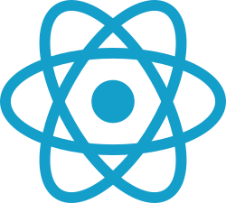

## Tecnologías usadas

GitTaur utiliza un stack tecnológico moderno que combina lenguajes y librerías ampliamente adoptados en la industria, como React y TypeScript en el frontend, junto con Tauri y Rust para el backend. Esta integración permite desarrollar una aplicación de escritorio eficiente, segura y fácil de mantener.

<h2>
    
    Tauri 2.0
</h2>

[Tauri](https://v2.tauri.app/es/) es el componente principal de GitTaur. Es un framework que permite la creación de binarios y ejecutables para cualquier sistema operativo, tanto de escritorio como de dispositivos móviles. Fue desarrollado con Rust con el objetivo de crear ejecutables que pesen poco y que sus aplicaciones tengan un consumo eficiente de la memoria. Similar a otros frameworks como [Electron](https://www.electronjs.org/), la interfaz gráfica de la aplicación se puede desarrollar usando cualquier tecnología web que compile a HTML, CSS y JavaScript para las aplicaciones de escritorio, y Swift o Kotlin para el desarrollo móvil, aprovechando los maduros ecosistemas alrededor de estas tecnologías.

Tauri provee canales de comunicación eficaces y fáciles de mantener entre el front y el back, diversidad de módulos llamados 'plugins' que complementan las funcionalidades de la aplicación (como cuadros de diálogo, lectura de archivos, sistemas de notificaciones, SQL, NFC, CLI, biometría y muchos más), y opciones de configuración de permisos y ámbito muy extensas para mejorar la seguridad de tu aplicación ajustando finamente sus capacidades.

<h2>
    
    
    React 18 + TypeScript - (Frontend)
</h2>

[React](https://es.react.dev/) es una librería destinada a la creación de interfaces de usuario mediante JavaScript, dividiendo el documento HTML en subcomponentes de manera que permite recargar partes del documento sin tener que refrescar la vista entera, mejorando la experiencia de usuario y los tiempos de carga. Destaca por su enfoque declarativo y la facilidad de reutilizar componentes, lo cual mejora la mantenibilidad del código. [TypeScript](https://www.typescriptlang.org/) complementa la funcionalidad de React frente al tradicional JavaScript gracias a su tipado estático, mejorando la seguridad del desarrollo. Ambos poseen ecosistemas maduros y amplias comunidades, lo cual facilita mucho el proceso de desarrollo.

<h2>
    
    Rust - (Backend)
</h2>

[Rust](https://www.rust-lang.org/es) es un lenguaje de programación multiparadigma bastante reciente (fue anunciado en 2010). Se enfoca en lograr el rendimiento de un lenguaje como C o C++, pero garantizando la seguridad de memoria sin necesidad de un garbage collector, gracias a su sistema de propiedad. Se considera un lenguaje de bajo nivel, aunque no tan bajo como C (lenguaje con el que se integra fácilmente), puesto que no permite la gestión manual de la memoria. Por otro lado, también permite la escritura de código concurrente y multihilo de manera muy fiable y predecible. Es por esto que Rust es el principal lenguaje de backend que las aplicaciones de Tauri deberían usar.

## Otras tecnologías usadas

- CSS: Estilos para la aplicación
- JSON: Archivos de guardado y configuración
- TOML: Configuración del proyecto
